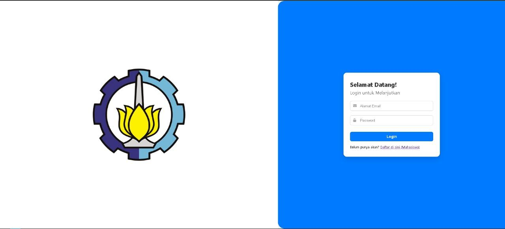
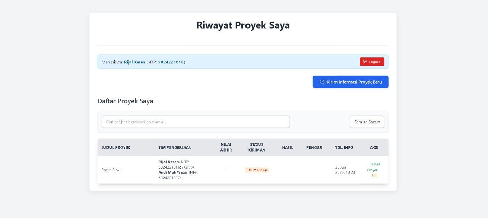
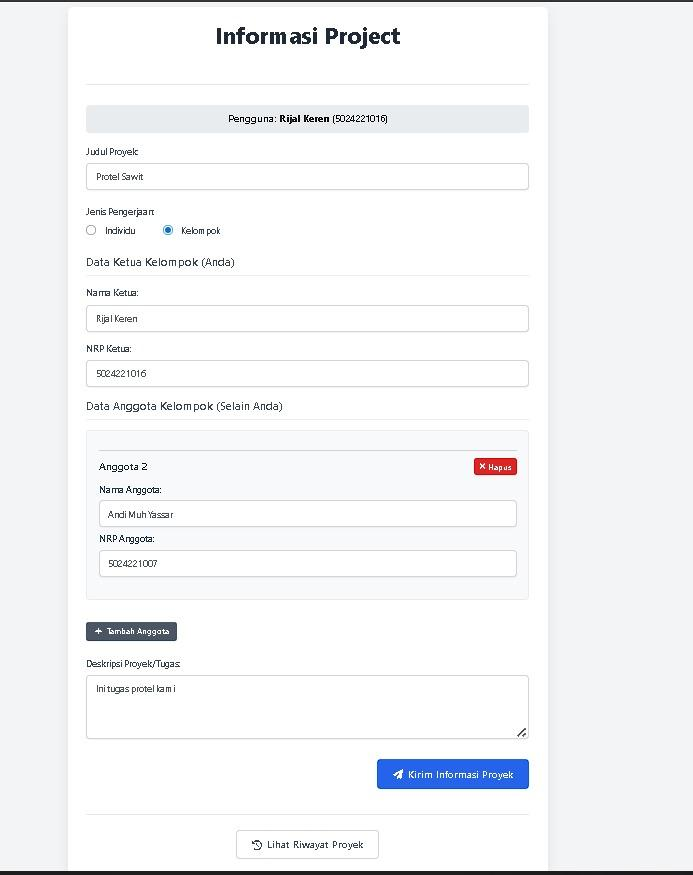
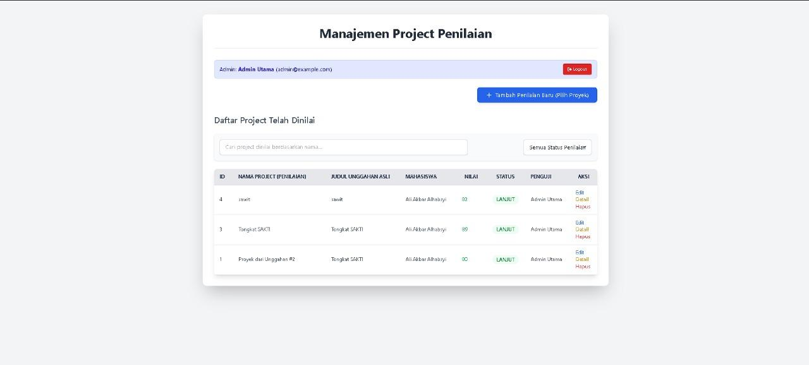
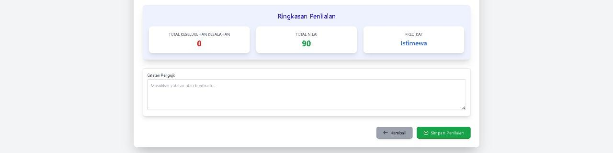
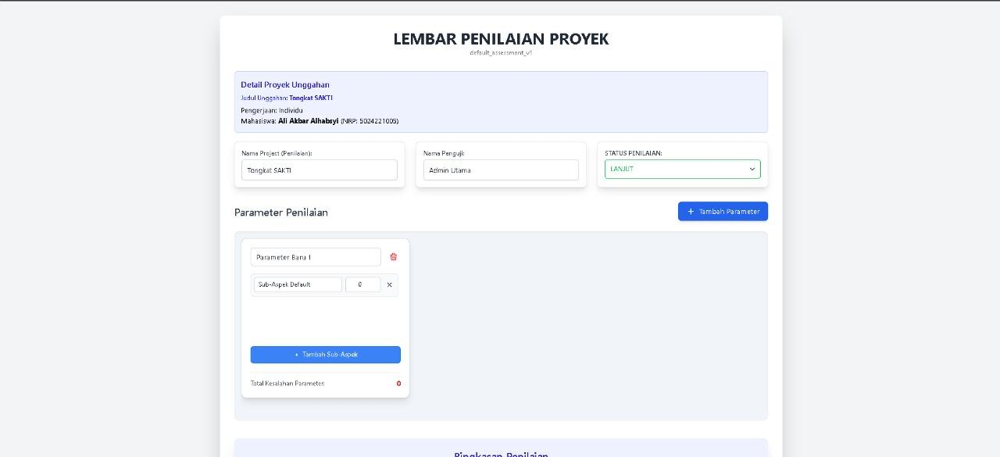

# Sistem Penilaian Proyek Mahasiswa

Sistem Penilaian Proyek adalah aplikasi web berbasis *Client-Server* yang dirancang untuk mengelola dan memfasilitasi proses evaluasi proyek akademik. Sistem ini mendukung *Role-Based Access Control* (Mahasiswa & Admin/Penguji) dengan fitur penilaian berjenjang (Parameter dan Sub-Aspek), otomatisasi kalkulasi nilai melalui *Stored Procedure* MySQL, serta manajemen pengajuan tugas secara komprehensif.

## Arsitektur & Teknologi Utama
- **Backend**: PHP (Pendekatan Prosedural, RESTful API via `API.php`)
- **Frontend**: HTML5, Vanilla JavaScript (Fetch API), CSS & Tailwind CSS
- **Database**: MySQL (Relational Database Management System)

## Fitur Utama
1. **Sistem Pengajuan Terpusat (Submission System)**
   Mahasiswa dapat mengunggah detail proyek, melacak status pengerjaan (Misal: *Dalam Penilaian*, *Perlu Revisi*), dan melihat riwayat nilai akhir secara transparan.
2. **Evaluasi Berjenjang (Hierarchical Assessment)**
   Penilai dapat membuat kriteria evaluasi dinamis yang dipecah menjadi beberapa parameter utama, di mana setiap parameter memiliki turunan sub-aspek yang lebih spesifik.
3. **Otomatisasi Basis Data (Database Automation)**
   - **Stored Procedure**: Penggunaan `RecalculateProjectTotals` yang secara otomatis dipanggil setiap kali terjadi transaksi (INSERT/UPDATE) untuk menghitung ulang total kesalahan pada setiap level relasi (Sub-Aspek -> Parameter -> Proyek Utama).
   - **Generated Columns**: Implementasi logika kalkulasi skor bawaan MySQL (`overall_total_score AS (90 - overall_total_mistakes)`) untuk memastikan integritas dan konsistensi data nilai akhir (Status Kelulusan: LANJUT/ULANG).
4. **Single Entry Point API & CORS**
   Seluruh interaksi data dikelola melalui `API.php` menggunakan pola *routing* sederhana berdasarkan `REQUEST_METHOD` (GET, POST, PUT, DELETE) yang sudah mendukung *Cross-Origin Resource Sharing* (CORS).

## Dokumentasi & Visualisasi

### Entity Relationship Diagram (ERD)
Arsitektur basis data dirancang untuk menjaga normalisasi data melalui relasi antara tabel `users`, `submissions`, `projects`, `project_parameters`, dan `sub_aspects`.

### Antarmuka Pengguna (User Interface)

**Halaman Registrasi & Otentikasi**

**Dasbor Mahasiswa: Riwayat Penilaian & Pengajuan Tugas**

**Dasbor Penguji: Manajemen & Evaluasi Proyek**

## Instalasi & Cara Menjalankan
1. Kloning repositori ini ke dalam direktori server lokal Anda (misal: `htdocs` untuk XAMPP atau direktori root Laragon).
2. Buat basis data baru pada MySQL (misal: `db_penilaian_proyek`).
3. Impor *dump file* basis data yang telah disediakan (`db_penilaian_proyek.sql`).
4. Sesuaikan kredensial koneksi basis data pada file `db_config.php`.
5. Buka `login.html` melalui peramban web untuk memulai menggunakan aplikasi.

---
**Kontributor**: Ali Akbar Alhabsyi (Backend API & Integrasi Database) - Proyek Basis Data 2025.
